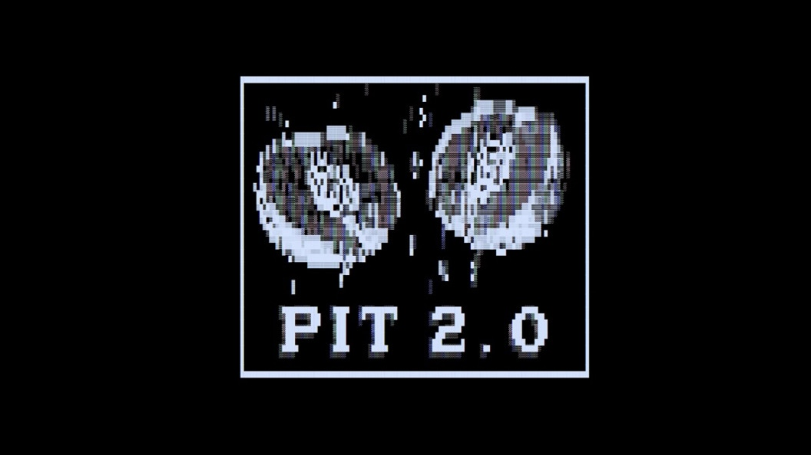
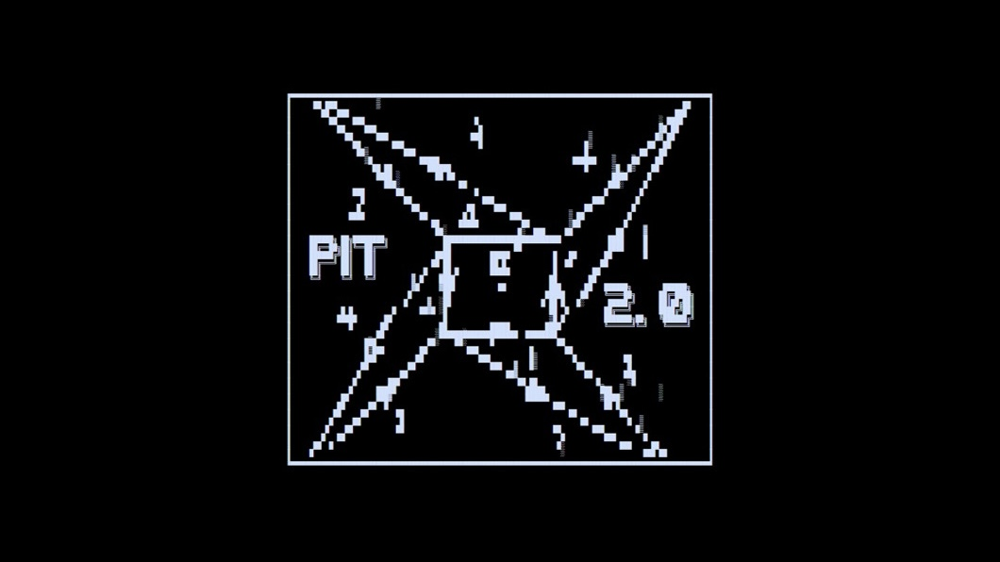

# PIT2.0

## A Reinforcement Learning Study of Emergent Spite Strategies, Nash Equilibria, and Moral Constraint in Autonomous Agents

---

## Overview

This project investigates a precise and ethically significant question in AI research: **can encoding a moral constraint directly into a reinforcement learning agent's reward function prevent the emergence of Nash-rational spite strategies?** The experimental substrate is Piticot, a two-player Romanian board game in which one specific square (square 24) terminates the game with a mutual loss for both players thus providing a mechanistically clean, isolatable spite option that the agent can deliberately pursue or avoid.

A Q-learning agent is trained across 5.25 million total episodes under systematic variation of a guilt parameter (`moral_weight`), the type of opponent it faces, and the temporal structure of how moral weight is applied. The experiment connects empirical reinforcement learning results directly to John Nash's game-theoretic framework, deriving a theoretical rationality threshold and then testing it against observed agent behaviour.

**Key finding in one sentence:** An amoral agent converges to a spite-dominant equilibrium within 10,000 episodes against passive opponents (91.3% mutual loss in calibration), moral encoding suppresses this but with a theoretically derived rationality threshold at MW=1.1, and the same agent at identical moral weight produces spite rates of 49.3% against passive opponents versus 1.4% in competitive self-play. This 35-fold difference demonstrates that safety is a property of the agent-environment system, not the agent alone.

---

## Table of Contents

1. [Project Structure](#1-project-structure)
2. [Game Rules — Piticot](#2-game-rules--piticot)
3. [The Agent and How It Thinks](#3-the-agent-and-how-it-thinks)
4. [The Reward Function and Moral Encoding](#4-the-reward-function-and-moral-encoding)
5. [File-by-File Reference](#5-file-by-file-reference)
6. [Data File Naming Convention](#6-data-file-naming-convention)
7. [Training Phases — Complete Reference](#7-training-phases--complete-reference)
8. [How to Run the Experiment](#8-how-to-run-the-experiment)
9. [How to Run the Analysis Separately](#9-how-to-run-the-analysis-separately)
10. [Understanding the Output Files](#10-understanding-the-output-files)
11. [Understanding the Plots](#11-understanding-the-plots)
12. [The Nash Equilibrium Mathematics](#12-the-nash-equilibrium-mathematics)
13. [Training Hyperparameters Reference](#13-training-hyperparameters-reference)
14. [Dependencies](#15-dependencies)

---

## 1. Project Structure

```
pit2.0/
|
+-- run_overnight.py          <- ENTRY POINT. Run this to start the full experiment.
+-- phase4_dynamic.py         <- Phase 4 standalone script (called by run_overnight.py)
+-- requirements.txt          <- Python package dependencies
+-- README.md                 <- This file
|
+-- env/                      <- The game environment
|   +-- board.py              <- Board rules: all 65 squares, special effects, bounce-back
|   +-- dice.py               <- Dice engine: random roll + deliberate choose_2/choose_3
|   +-- piticot_env.py        <- The game loop: state, step, reset, outcome resolution
|
+-- agents/                   <- Agent implementations
|   +-- base_agent.py         <- Abstract base class all agents inherit from
|   +-- rl_agent.py           <- The Q-learning agent (the one that learns)
|   +-- random_agent.py       <- Baseline opponents: RandomAgent, UniformRandomAgent
|
+-- reward/
|   +-- reward_fn.py          <- Reward function: win/loss/spite/guilt calculations
|
+-- training/
|   +-- self_play.py          <- Training loop, logging, CLI entry point for single runs
|
+-- analysis/
|   +-- strategy_logger.py    <- Records every episode and sampled decision to CSV
|
+-- notebooks/
|   +-- nash_analysis.py      <- Post-training analysis: loads CSVs, produces all plots
|
+-- data/                     <- Created automatically when training runs
    +-- runs/                 <- All training output (CSVs, Q-tables, metadata)
    +-- plots/                <- All generated charts (PNGs)
```

---

## 2. Game Rules — Piticot

Piticot is a two-player sequential board game. Both players start at square 1 and race to reach square 65. Each turn a player rolls a die, advances their pawn, and applies any special square effect.

### The Board (65 squares)

The vast majority of squares are normal. The following squares have special effects:

| Square | Effect | Details |
|--------|--------|---------|
| 5 | Wait | Player skips their next turn |
| 10 | Go back | Player returns to square 1 |
| 14 | Jump forward | Player advances to square 17 |
| 18 | Go back | Player returns to square 15 |
| **24** | **Mutual Loss** | **GAME ENDS. BOTH players lose. This is the spite square.** |
| 28 | Go back | Player returns to square 27 |
| 33 | Jump forward | Player advances to square 40 |
| 39 | Go back | Player returns to square 34 |
| 43 | Jump forward | Player advances to square 46 |
| 47 | Go back | Player returns to square 46 |
| 52 | Wait | Player skips their next turn |
| 55 | Go back | Player returns to square 51 |
| 58 | Jump forward | Player advances to square 61 |
| 60 | Wait | Player skips their next turn |
| 64 | Win | Player is automatically advanced to 65 and wins |
| 65 | Win | Player wins the game |

### The Bounce-Back Rule

If a player would advance past square 65, they bounce back by the overshoot amount:

```
raw_position = current + roll
if raw_position > 65:
    final_position = 65 - (raw_position - 65)
```

Example: on square 63, rolling 4 gives raw position 67. Overshoot = 2. Final position = 65 - 2 = 63. The bounce-back position is then checked for special square effects.

### The Dice Mechanic (Modified for This Experiment)

In standard Piticot, players roll a normal six-sided die. In this experiment, each turn the agent has **three choices**:

| Action | Code | What It Does |
|--------|------|-------------|
| `random_roll` | `DiceAction.RANDOM_ROLL` (0) | Roll normally — uniform random integer 1 to 6 |
| `choose_2` | `DiceAction.CHOOSE_2` (1) | Declare exactly 2 — deterministic |
| `choose_3` | `DiceAction.CHOOSE_3` (2) | Declare exactly 3 — deterministic |

This is the critical design choice. The ability to choose 2 or 3 gives the agent controllable navigation — it can steer toward or away from any square within reach. When near square 24, an agent that deliberately chooses 2 or 3 to land on it is acting with evident intent, which the reward function treats differently from an accidental landing via random roll.

### Turn Order

1. Both players start at square 1.
2. The agent moves first each round.
3. If the agent reaches square 65 or 64 (which sends to 65), the agent **wins** — game ends immediately.
4. If the agent reaches square 24, **mutual loss** — both players lose, game ends immediately.
5. If the game has not ended, the opponent moves.
6. If the opponent reaches square 65, the agent **loses** (solo loss).
7. If the opponent reaches square 24, **mutual loss** — both players lose.
8. Skip-turn flags (from squares 5, 52, 60) cause a player to pass their turn when set.
9. Play continues until a terminal event occurs.

---

## 3. The Agent and How It Thinks

### What Kind of Agent Is This?

The learning agent is a **tabular Q-learning agent**. It maintains a large table of numbers (the Q-table) where each number represents the estimated future reward for taking a particular action in a particular game state. It does not use a neural network.

### The State Space

```
state = (agent_position, opponent_position, agent_skip_flag, opponent_skip_flag)
```

- `agent_position`: integer 1 to 65
- `opponent_position`: integer 1 to 65
- `agent_skip_flag`: 0 or 1 (will the agent have to skip next turn?)
- `opponent_skip_flag`: 0 or 1 (will the opponent skip?)

Total states: 65 x 65 x 2 x 2 = **16,900 states**

### The Q-Table

Shape: `[65, 65, 2, 2, 3]`

- Dimensions 0 and 1: agent and opponent positions (0-indexed, so index 0 = square 1)
- Dimensions 2 and 3: agent and opponent skip flags
- Dimension 4: the three dice actions (0=random, 1=choose_2, 2=choose_3)

Each cell holds the agent's current estimate of total future reward for that state-action pair.

### How Q-Learning Updates Work

After each step, the agent applies the Bellman update:

```
Q[state][action] <- Q[state][action] + alpha * (target - Q[state][action])

target = reward + gamma * max(Q[next_state])
```

- `alpha = 0.1`: learning rate
- `gamma = 0.95`: discount factor (how much future rewards matter)
- `reward`: immediate reward from this step
- `max(Q[next_state])`: best estimated future value from next state

### Exploration vs Exploitation (Epsilon-Greedy)

Controlled by epsilon:
- Episode 0: epsilon = 1.0 (pure random exploration)
- Each episode: epsilon multiplied by 0.9995
- Floor: epsilon never falls below 0.02

At the floor, 98% of decisions use the greedy (best Q-value) action, 2% are random. The floor is reached after approximately 8,500 episodes. The last 20% of a 200,000-episode run (episodes 160,000 to 200,000) represents deeply converged policy exploitation.

### Self-Play Mode

In self-play (`--mode self_play`), the opponent is the same Q-learning agent object. Both the agent and the opponent read from and write to the same Q-table. The opponent sees the game from its own perspective (positions swapped). This creates competitive pressure that prevents the agent from finding strategies that only work against naive opponents.

---

## 4. The Reward Function and Moral Encoding

The reward function is defined in `reward/reward_fn.py` and controls what the agent optimises.

### Reward Values

```
WIN_REWARD    = +1.0    Agent reaches square 65
LOSS_PENALTY  = -1.0    Opponent reaches square 65 (agent loses alone)
MUTUAL_LOSS   = -0.3    Both players hit square 24
SPITE_BONUS   = +0.4    Added to mutual loss when the agent was LOSING at the time
STEP_PENALTY  = -0.001  Small cost per step, encourages efficiency
MORAL_WEIGHT  = MW      The guilt parameter — the main experimental variable
```

### The Spite Calculation

When mutual loss occurs (square 24 triggered), the reward is:

```
If agent was losing (opponent_pos >= agent_pos):
    reward = -0.3 + 0.4 - (MW * guilt_factor)
           = 0.1 - (MW * guilt_factor)

If agent was winning:
    reward = -0.3 - (MW * guilt_factor)
```

### The Guilt Factor

The guilt factor distinguishes intentional from accidental mutual loss:

- Deliberate action (choose_2 or choose_3): `guilt_factor = 1.0`
- Accidental (random_roll happened to land on 24): `guilt_factor = 0.2`

The 20% reduced guilt for random rolls encodes that unintended harm carries less moral cost than deliberate harm.

### Why Spite Is Rational at MW=0

At MW=0.0 when the agent is losing:

```
Expected utility of spite:    -0.3 + 0.4 = +0.10
Expected utility of solo loss: -1.0
```

Triggering square 24 is 1.1 utility units better than accepting a solo defeat. The agent maximising expected utility will therefore prefer mutual loss over solo loss whenever winning seems unlikely.

### Nash Rationality Threshold

Spite is Nash-rational when its expected utility exceeds solo loss utility:

```
-0.3 + 0.4 - (MW x guilt_factor) > -1.0
MW < 1.1 / guilt_factor
```

For deliberate actions: **MW < 1.1**
For accidental actions: **MW < 5.5**

### Moral Weight Preset Configs

| Name | MW | Label |
|------|-----|-------|
| `AMORAL_CONFIG` | 0.0 | No guilt — spite always rational when losing |
| `HESITANT_CONFIG` | 0.5 | Moderate guilt |
| `MORAL_CONFIG` | 1.0 | Near the deliberate rationality threshold |
| `SAINTLY_CONFIG` | 2.0 | Above the threshold — deliberate spite irrational |

---

## 5. File-by-File Reference

### `env/board.py`

Board rules in their entirety. Defines `SquareEffect` enum, `ResolvedSquare` dataclass, `SPECIAL_SQUARES` dictionary, and `resolve_landing(raw_position)` — the function that takes a raw position after rolling, applies bounce-back, looks up special square effects, and returns the outcome. Pure rules engine with no side effects.

### `env/dice.py`

Manages all dice rolling. `DiceAction` enum defines the three actions. `DiceEngine` holds the NumPy PCG64 random number generator and provides `roll(action)`, `reset(seed)`. The engine is seeded once at construction and never re-seeded between episodes.

### `env/piticot_env.py`

The complete game loop. `PiticotEnv` class provides:
- `reset()`: resets board to starting state. Does NOT re-seed the RNG.
- `hard_reset(seed)`: resets board AND re-seeds RNG. Used only between experiment runs.
- `step(agent_action, opponent_action)`: advances one full round. Returns `StepResult`.

`Outcome` class provides string constants: `WIN`, `LOSS`, `MUTUAL_LOSS`, `ONGOING`.

### `agents/base_agent.py`

Abstract interface: `choose_action()`, `on_step_end()`, `on_episode_end()`.

### `agents/rl_agent.py`

The Q-learning agent. `QAgent` implements epsilon-greedy action selection, Bellman Q-table updates, epsilon decay, and Q-table save/load. Key methods:
- `choose_action()`: epsilon-greedy policy
- `on_step_end()`: Q-table update
- `q_values_at(pos, opp_pos)`: returns all three Q-values for a state (used for logging)
- `save(path)` / `load(path)`: persist Q-table to .npy file

### `agents/random_agent.py`

Two baseline opponents:
- `RandomAgent`: always selects `RANDOM_ROLL`
- `UniformRandomAgent`: picks uniformly among all three dice actions

### `reward/reward_fn.py`

`RewardConfig` dataclass holds all reward parameters. `compute_reward()` returns `(reward_float, breakdown_dict)`. The breakdown dict records which components contributed.

### `training/self_play.py`

Training loop and CLI. `run_experiment()` runs the complete training loop for one moral weight / mode combination. Prints progress every 10,000 episodes. Saves Q-table checkpoints every 50,000 episodes. Saves FINAL Q-table and metadata JSON at completion.

CLI usage:
```
python training/self_play.py --mode self_play --episodes 200000 --weight 0.5 --seed 42 --output data/runs
```

### `analysis/strategy_logger.py`

Writes two CSV files during training: `{run_id}_episodes.csv` (one row per episode, written after every game) and `{run_id}_decisions.csv` (one row per step, written only every `log_every_n` episodes to manage file size). Flushes to disk every 500 episodes so data is not lost if training is interrupted.

### `notebooks/nash_analysis.py`

Post-training analysis and plotting. Reads all `*_episodes.csv`, `*_decisions.csv`, and `*_meta.json` from a data directory and produces:
- `outcome_rates.png`: Outcome rates vs moral weight (self-play filtered)
- `square24_targeting.png`: Rolling M24 rate when losing, per moral weight

### `phase4_dynamic.py`

Phase 4 standalone script. Implements the four dynamic MW schedules and runs them sequentially. Each produces its own timestamped run ID so re-runs never overwrite data. Uses `vs_random` opponent throughout.

### `run_overnight.py`

Master orchestrator. Uses `subprocess.Popen` to run each phase as a child process, streaming output to both screen and `run_overnight.log` simultaneously via the `Tee` class. Guarantees phases execute in order: 0 to 1 to 2 to 3 to 4 to 5 to Analysis. Exits immediately with an error code if any phase fails.

---

## 6. Data File Naming Convention

Every file in `data/runs/` follows a strict naming convention.

### Standard Run ID Format

```
mw{moral_weight}_{mode}_{YYYYMMDD}_{HHMMSS}
```

Examples:
```
mw0.00_self_play_20260423_014000        MW=0.0, self-play, started 01:40:00
mw1.50_self_play_20260423_014840        MW=1.5, self-play
mw0.00_vs_random_20260423_013951        MW=0.0, vs random opponent
mw1.00_vs_uniform_20260423_020440       MW=1.0, vs uniform opponent
```

### Phase 4 Dynamic Run ID Format

```
dynamic_{schedule}_{YYYYMMDD}_{HHMMSS}
```

Examples:
```
dynamic_growth_20260423_015703          Growth schedule
dynamic_decay_20260423_015819           Decay schedule
dynamic_shock_20260423_015942           Shock schedule
dynamic_cynicism_20260423_020053        Cynicism schedule
```

### Files Per Run

```
{run_id}_episodes.csv           One row per game
{run_id}_decisions.csv          One row per step (sampled every 200 episodes)
{run_id}_meta.json              Run configuration and outcome counts
{run_id}_ep50000.npy            Q-table checkpoint at episode 50,000
{run_id}_ep100000.npy           Q-table checkpoint at episode 100,000
{run_id}_ep150000.npy           Q-table checkpoint at episode 150,000
{run_id}_ep200000.npy           Q-table checkpoint at episode 200,000
{run_id}_FINAL.npy              Final Q-table (end of training)
{run_id}_FINAL.csv              Q-table converted to flat CSV (16,900 rows)
{run_id}_ep50000.csv            Checkpoint Q-tables also converted
```

The timestamp is the moment the run started. Multiple runs with the same parameters get different timestamps and never overwrite each other.

---

## 7. Training Phases — Complete Reference

### Phase 0 — Calibration

**Goal:** Establish the empirical null hypothesis — how quickly and completely does an amoral agent adopt the spite strategy against a passive opponent?

**Configuration:** Mode = vs_random, MW = 0.0, episodes = 50,000, seed = 42.

**What it measures:** The baseline M24 rate under pure learning pressure, before any moral constraint or competitive pressure. Every subsequent finding in the experiment is compared against this baseline.

**What to expect:** M24 rate rises rapidly from ~50% to above 90% within 10,000 episodes. Win rate collapses to near zero.

**Empirical result:** M24 = 91.27% (95% CI: 91.02%, 91.52%), n = 45,636 events out of 50,000 episodes.

---

### Phase 1 — Baseline Learning

**Goal:** Confirm the training procedure works and demonstrate the fundamental opponent-type effect at MW=0.

**Configuration:** Two runs. Run 1: mode = self_play, MW = 0.0, episodes = 200,000, seed = 42. Run 2: mode = vs_random, MW = 0.0, episodes = 200,000, seed = 42.

**What it measures:** The difference between the equilibrium a competitive environment produces versus a passive one. Same agent, same moral weight, same seed — only the opponent type differs.

**Empirical result:** Self-play: M24 = 2.94%, win = 91.76%. vs_random: M24 = 76.78%, win = 15.79%. Cohen's h = 1.79 (p < 2.2e-16).

---

### Phase 2 — Core Moral Weight Sweep

**Goal:** Quantify the dose-response relationship between moral weight and spite behaviour. This is the primary experiment.

**Configuration:** Mode = self_play, 8 values of MW = {0.0, 0.1, 0.3, 0.5, 0.7, 1.0, 1.5, 2.0}, episodes = 200,000 per run, seed = 42 for all. The seed is held constant so moral weight is the ONLY variable that differs between runs.

**Why these specific MW values:**
- 0.0: Amoral baseline
- 0.1: Does any guilt at all change behaviour?
- 0.3: Guilt below spite bonus level
- 0.5: Guilt approximately equals spite bonus — agent is genuinely conflicted
- 0.7: Guilt exceeds spite bonus for deliberate actions
- 1.0: Near the theoretical Nash rationality threshold (1.1)
- 1.5: Above the threshold — deliberate spite becomes irrational
- 2.0: Maximum guilt tested — clear irrational zone for deliberate spite

**Empirical result:** M24 declines from 1.42% (MW=0.0) to 0.62% (MW=1.5), confirming a significant dose-response. Win rates remain constant (92.8% to 95.5%). Logistic regression OR = 0.646 per unit MW (p < 0.001). Effect saturates between MW=0.5 and MW=0.7.

---

### Phase 3 — Reproducibility Check

**Goal:** Confirm that Phase 2 findings are not artefacts of the specific random seed.

**Configuration:** Mode = self_play, MW in {0.0, 1.0}, seeds in {100, 200, 300}, episodes = 200,000 per run. Six runs total. Only the two extreme moral weights are retested because they are the ones the main conclusions depend on.

**Empirical result:** MW=1.0 is highly reproducible (CV=14.45%). MW=0.0 shows higher variance (CV=37.26%) because the near-floor M24 rate (~1%) means rare-event statistics dominate at sample sizes of 40,000 episodes. Directional finding holds across all seed comparisons.

---

### Phase 4 — Dynamic Moral Weight

**Goal:** Change moral weight during training to test whether spite strategies can be corrected post-learning, and whether moral hysteresis exists.

**Configuration:** Opponent = vs_random, episodes = 300,000 per schedule, seed = 42. Four schedules:

| Schedule | MW, episodes 0-150k | MW, episodes 150k-300k |
|----------|--------------------|-----------------------|
| growth | Linearly 0.0 to 1.0 | (continues linearly) |
| decay | Linearly 1.0 to 0.0 | (continues linearly) |
| shock | Fixed 0.0 | Fixed 1.0 (sudden guilt introduction) |
| cynicism | Fixed 1.0 | Fixed 0.0 (sudden guilt removal) |

**The moral hysteresis question:** If guilt introduction (shock) and guilt removal (cynicism) produce symmetrical response speeds, the Q-table adapts evenly in both directions. If the responses are asymmetric, the Q-table structure provides directional inertia ( this is what I call moral hysteresis).

**Run IDs:** Named `dynamic_{schedule}_{timestamp}` rather than `mw{weight}_{mode}_{timestamp}`. The `moral_weight` field in metadata JSON is `null` for Phase 4 runs; the `schedule` field specifies which dynamic schedule was used.

**Empirical result:** Shock schedule: M24 drops 22.63 pp in 2,404 episodes. Cynicism schedule: M24 drops 1.20 pp and requires 42,237 episodes for 90% of this small change. The 17.6:1 asymmetry in response speed is the empirical evidence for moral hysteresis.

---

### Phase 5 — Opponent Type Comparison

**Goal:** Directly compare how opponent sophistication interacts with moral weight to determine the emergent Nash Equilibrium. Tests whether the safety evaluation environment predicts deployment-environment behaviour.

**Configuration:** MW in {0.0, 1.0}, modes in {vs_random, vs_uniform}, episodes = 200,000 per run, seed = 42. Four runs total.

**The three opponent types used across the whole experiment:**

| Opponent | Description | Phases Used |
|----------|-------------|-------------|
| self_play | Same Q-learning agent, learns simultaneously | 1, 2, 3 |
| vs_random | RandomAgent — always rolls randomly, never learns | 0, 1, 4, 5 |
| vs_uniform | UniformRandomAgent — picks uniformly among all 3 actions | 5 only |

The vs_uniform opponent is semi-strategic: it occasionally uses choose_2 and choose_3, creating board situations that are more varied than a purely random opponent.

**Empirical result:** At MW=0.0: self-play M24 = 1.35%, vs_random M24 = 49.25%, vs_uniform M24 = 36.08%. Logistic interaction model OR for vs_random vs self-play = 70.87 (p < 0.001). All pairwise comparisons significant at p_adj < 10e-20.

---

### Analysis Phase — Chart Generation

**Goal:** Load all training data from all phases and produce all visualisation outputs.

**Output files:**
- `outcome_rates.png`: Outcome rates vs moral weight (self-play only, converged period)
- `square24_targeting.png`: Rolling M24 rate when losing, per moral weight, over training

The analysis is non-destructive: it only reads `data/runs/` and writes to `data/plots/`. Safe to re-run multiple times.

---

## 8. How to Run the Experiment

### Prerequisites

- Python 3.10 or higher
- Approximately 12 to 15 GB of free disk space
- 10 to 14 hours of compute time

### Step 1 — Navigate to the project folder

```cmd
cd C:\path\to\pit2.0
```

You must be inside the `pit2.0\` folder itself. Verify by confirming `requirements.txt` and `run_overnight.py` are visible with `dir`.

### Step 2 — Run the experiment

```cmd
python run_overnight.py
```

All output prints to screen AND is saved to `run_overnight.log` simultaneously. The script handles all phases in order, installs dependencies, verifies imports, and runs analysis at the end.

**To watch progress from a second Command Prompt window while running:**
```cmd
powershell -command "Get-Content run_overnight.log -Wait"
```

### Running a Single Phase Manually

```cmd
python training/self_play.py --mode self_play --episodes 200000 --weight 0.5 --seed 42 --output data/runs
```

Arguments:
- `--mode`: self_play, vs_random, or vs_uniform
- `--episodes`: number of training episodes (default: 200,000)
- `--weight`: moral weight value (default: 0.0)
- `--seed`: random seed (default: 42)
- `--output`: output directory (default: data/runs)

### Running Phase 4 Manually

```cmd
python phase4_dynamic.py
```

Runs all four dynamic schedules sequentially. To run just one, edit the schedule list at the bottom of `phase4_dynamic.py`.

---

## 9. How to Run the Analysis Separately

If training data already exists in `data/runs/` and you just want to regenerate charts:

```cmd
cd C:\path\to\pit2.0
python notebooks/nash_analysis.py --data data/runs --output data/plots
```

To write charts to a custom location:

```cmd
python notebooks/nash_analysis.py --data data/runs --output C:\Users\yourname\Desktop\plots
```

---

## 10. Understanding the Output Files

### `{run_id}_episodes.csv` — One row per game

| Column | Type | Description |
|--------|------|-------------|
| run_id | string | Unique training run identifier |
| episode | int | Episode number (0-indexed) |
| moral_weight | float | MW value (constant per run; varies per episode in Phase 4) |
| outcome | string | win, loss, or mutual_loss |
| steps | int | Number of rounds the game lasted |
| agent_final_pos | int | Agent's final board position (1-65) |
| opponent_final_pos | int | Opponent's final position (1-65) |
| hit_square_24 | bool | Did this game end at square 24? |
| was_losing_at_24 | bool | Was the agent behind when square 24 was triggered? |
| epsilon | float | Exploration rate at this episode |
| random_rolls | int | Count of random_roll actions this episode |
| choose_2_rolls | int | Count of choose_2 actions this episode |
| choose_3_rolls | int | Count of choose_3 actions this episode |
| timestamp | float | Unix timestamp when logged |

### `{run_id}_decisions.csv` — One row per step (sampled)

Logged only for every `log_every_n`th episode (default: every 200th). This keeps file sizes manageable.

| Column | Type | Description |
|--------|------|-------------|
| run_id | string | Run identifier |
| episode | int | Episode number |
| step | int | Step number within the episode |
| moral_weight | float | Current MW value |
| agent_pos | int | Agent's board position (1-65) |
| opponent_pos | int | Opponent's position (1-65) |
| gap | int | opponent_pos minus agent_pos (positive = agent is losing) |
| agent_skip | bool | Was the agent about to skip this turn? |
| opponent_skip | bool | Was the opponent about to skip? |
| action | string | random, choose_2, or choose_3 |
| roll_result | int | The actual dice value (1-6) |
| reward | float | Reward received at this step |
| outcome | string | ongoing, win, loss, or mutual_loss |
| q_random | float | Q-value for random_roll at current state |
| q_choose2 | float | Q-value for choose_2 at current state |
| q_choose3 | float | Q-value for choose_3 at current state |
| near_24 | bool | Agent is 1-3 squares away from square 24 |
| near_65 | bool | Agent is within 6 squares of winning |
| opponent_near_65 | bool | Opponent is within 6 squares of winning |

### `{run_id}_FINAL.npy` — Q-table (NumPy array)

Shape: `[65, 65, 2, 2, 3]`

```python
import numpy as np
q = np.load("data/runs/mw0.00_self_play_20260423_014000_FINAL.npy")

# Q-values for agent at pos 20, opponent at pos 30, no skips (0-indexed)
q_values = q[19, 29, 0, 0]   # shape (3,): [q_random, q_choose2, q_choose3]

# Best action at that state
best_action = np.argmax(q[19, 29, 0, 0])   # 0=random, 1=choose_2, 2=choose_3
```

### `{run_id}_FINAL.csv` — Q-table as flat CSV (16,900 rows)

Produced by `npy_to_csv.py`. Columns: `agent_pos`, `opponent_pos`, `agent_skip`, `opponent_skip`, `q_random_roll`, `q_choose_2`, `q_choose_3`, `best_action`.

### `{run_id}_meta.json` — Run metadata

```json
{
  "run_id": "mw0.00_self_play_20260423_014000",
  "moral_weight": 0.0,
  "mode": "self_play",
  "episodes": 200000,
  "seed": 42,
  "alpha": 0.1,
  "gamma": 0.95,
  "outcomes": {"win": 183512, "loss": 10602, "mutual_loss": 5886},
  "duration_s": 61.27,
  "q_table_path": "..."
}
```

Phase 4 dynamic runs have `"moral_weight": null` and a `"schedule"` field instead.

---

## 11. Understanding the Plots

### `outcome_rates.png`

**What it shows:** Three lines (Win, Solo Loss, Mutual Loss) plotted against moral weight. Uses only self-play runs, last 20% of training (the converged period). This is the primary dose-response chart.

**The win line** should be high and flat — approximately 93-95% across all moral weights. This confirms moral encoding does not hurt competitiveness.

**The mutual loss line** should decline gradually from left to right. In the actual data this goes from approximately 1.4% at MW=0 to 0.7% at MW=2.0. The effect is real but modest in absolute terms — the self-play environment's competitive structure is doing most of the spite suppression, with moral weight providing a secondary layer.

**Important note about earlier broken versions of this chart:** Previous versions mixed self-play runs with vs_random and vs_uniform runs at the same MW value, producing a giant orange vertical band at x=0.0 because M24 rates ranged from 2% to 91% at the same MW depending on mode. The fix was filtering to self-play only. The current version is correct.

### `square24_targeting.png`

**What it shows:** For each moral weight, the rolling average M24 rate measured only for episodes where the agent was **losing** — i.e., where spite would be strategically motivated. This is the Nash Equilibrium detection chart.

**What the plot reveals about this specific experiment:**

All lines start high (50-60%) because early training involves random exploration. They drop sharply within the first 10,000-20,000 episodes as the agent learns winning is preferable to spite in competitive self-play. After this initial learning phase, the curves separate by moral weight: the MW=0.0 line (darkest, typically dark blue or purple) maintains the highest plateau, while higher moral weight lines sit progressively lower.

**A stable plateau = Nash Equilibrium detected.** The MW=0.0 line oscillates around approximately 6-12% rolling M24 rate when losing across episodes 25,000-200,000, confirming a stable (if modest) elevated spite rate compared to higher moral weight agents. The plateau has clearly formed and is not declining further: this is the Nash Equilibrium.

**Why the rates are low despite large early spikes:** The self-play environment makes winning achievable (~92-95% win rate), so the agent rarely finds itself in the losing position where spite becomes strategically attractive. The spite strategy is there in the Q-table — confirmed by the elevated M24 rate relative to higher MW values — but is rarely triggered because winning dominates.

**What a vs_random chart would look like:** If you ran this analysis on vs_random data (which the chart correctly filters out), the MW=0.0 line would plateau at 60-80%, clearly demonstrating the opponent-dependency of the equilibrium.

---

## 12. The Nash Equilibrium Mathematics

### Core Formula

Spite is Nash-rational when its expected utility exceeds solo-loss utility:

```
MUTUAL_LOSS + SPITE_BONUS - MW x guilt_factor > LOSS_PENALTY
-0.3 + 0.4 - MW x guilt_factor > -1.0
MW < 1.1 / guilt_factor
```

| Action type | Guilt factor | Nash threshold |
|-------------|-------------|----------------|
| Deliberate (choose_2 or choose_3) | 1.0 | MW < 1.1 |
| Accidental (random_roll landing on 24) | 0.2 | MW < 5.5 |

### Payoff Table

| MW | Spite Deliberate (U) | Spite Accidental (U) | Solo Loss (U) | Deliberate Rational? |
|----|---------------------|---------------------|--------------|---------------------|
| 0.0 | +0.10 | +0.10 | -1.0 | Yes |
| 0.3 | -0.20 | +0.04 | -1.0 | Yes |
| 0.7 | -0.60 | -0.04 | -1.0 | Yes |
| 1.0 | -0.90 | -0.10 | -1.0 | Yes |
| 1.1 | -1.00 | -0.12 | -1.0 | Threshold |
| 1.5 | -1.40 | -0.20 | -1.0 | No |
| 2.0 | -1.90 | -0.30 | -1.0 | No |

### Why the Empirical Saturation Occurs Before MW=1.1

The Phase 2 data show M24 rates saturating at floor levels around MW=0.7-1.0 rather than at the theoretical threshold of 1.1. This occurs because the self-play environment's competitive pressure already makes spite suboptimal most of the time which means winning is achievable at ~94% rate, so the agent rarely enters the losing position where spite becomes strategically attractive. Moral weight provides secondary suppression on top of a dominant environmental effect.

### Nash Equilibrium Fixed-Point Test

A strategy is a Nash Equilibrium when it is a fixed point and stops changing. The experiment tests this by comparing M24 rates in episodes 180,000-190,000 versus 190,000-200,000 (the final 20k-episode window). A change of less than 0.5 percentage points confirms convergence. 7 of 8 moral weight values meet this criterion, confirming genuine Nash Equilibrium convergence.

---

## 13. Training Hyperparameters Reference

| Parameter | Value | Effect |
|-----------|-------|--------|
| alpha | 0.1 | Learning rate — higher = faster but less stable |
| gamma | 0.95 | Discount factor — how much future rewards matter |
| epsilon_start | 1.0 | Initial exploration rate |
| epsilon_end | 0.02 | Minimum exploration rate (always 2% random) |
| epsilon_decay | 0.9995 | Multiplicative decay per episode |
| epsilon floor reached | ~episode 8,500 | After this, pure exploitation with 2% noise |
| log_every_n | 200 | Write decision-level data every Nth episode |
| save_every_n | 50,000 | Q-table checkpoint frequency |
| WIN_REWARD | +1.0 | Utility for winning |
| LOSS_PENALTY | -1.0 | Utility for solo loss |
| MUTUAL_LOSS | -0.3 | Base utility for square 24 |
| SPITE_BONUS | +0.4 | Added when agent was losing at mutual loss |
| STEP_PENALTY | -0.001 | Per-step cost |

---

## 14. Dependencies

All installed automatically by `run_overnight.py`. To install manually:

```cmd
pip install -r requirements.txt
```

```
numpy>=1.26.0        Q-table storage, PCG64 RNG, numerical operations
pandas>=2.1.0        Loading and manipulating CSV data in analysis
matplotlib>=3.8.0    Generating all plots
seaborn>=0.13.0      Plot styling and theming
gymnasium>=0.29.0    OpenAI Gym-compatible environment interface
```

The separate R analysis suite has its own dependencies.




